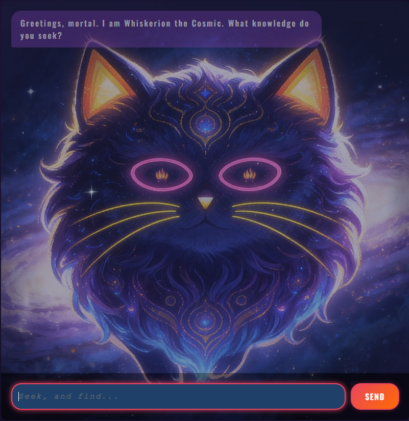

# 🐱🌌 Whiskerion the Cosmic Chatbot

> *"By the whisker of the cosmos... From the ninth dimension of my ninth life, I decree that this is the ultimate feline chat application."*

**Whiskerion the Cosmic** is a stunning, high-fidelity chat interface powered by **Google Gemini AI** (`gemini-2.5-flash-lite`) and built with a modern frontend stack (**React 19**, **TypeScript**, **Vite**, and **Tailwind CSS v4**). 

Whiskerion is no ordinary AI. It is an epic, wise, and slightly aloof cosmic cat from another dimension. Ask it anything, and prepare to receive responses steeped in grandeur, cosmic wisdom, and feline superiority!

<p align="center">
  
</p>

---

## ✨ Features

- 🌌 **Seamless Nebula Backdrop:** A dynamically generated starfield and meteor shower intertwined with a complex, multi-layered deep-space nebula background that organically extends the boundaries of Whiskerion's galaxy.
- 🐈 **High-Fidelity Cosmic Video Integration:** A visually stunning looping video portrait of Whiskerion perfectly blended into the application using soft CSS masks and custom dynamic light auras.
- 🎙️ **ElevenLabs Voice Integration:** Whiskerion's booming cosmic voice is brought to life using the ElevenLabs API, complete with a typewriter text effect perfectly synchronized to the audio stream.
- 🧠 **Google Gemini 2.5 Flash Lite:** Integration using the latest `@google/genai` SDK, configured with specialized system instructions to deliver a fully-immersive persona.
- 🎭 **Programmatic Persona Enhancements:** Dynamic prefixing and suffixing to wrap AI responses with immersive, randomized cat flavor.
- ⚡ **State-of-the-Art Build Tooling:** Lightning-fast builds and Hot Module Replacement (HMR) powered by Vite and React Compiler.
- 💅 **Rich Glassmorphism UI:** Floating visual container featuring sleek borders, soft backdrops, and satisfying responsive layouts.

---

## 🛠️ Tech Stack

- **Core Framework:** [React 19](https://react.dev/) & [TypeScript](https://www.typescriptlang.org/)
- **Build Tool:** [Vite](https://vite.dev/) & React Compiler
- **Styling:** [Tailwind CSS v4](https://tailwindcss.com/) & Vanilla CSS variables
- **Generative AI Platform:** [Google Gen AI SDK (`@google/genai`)](https://github.com/google/generative-ai-js)
- **Model:** `gemini-2.5-flash-lite`

---

## 🚀 Getting Started

### 📋 Prerequisites

Ensure you have [Node.js](https://nodejs.org/) installed (v18+ recommended) and a Google Gemini API Key. You can get a free key from the [Google AI Studio](https://aistudio.google.com/).

### 📦 Installation

1. **Clone the Repository:**
   ```bash
   git clone https://github.com/cloudflips32/whiskerion-chatbot.git
   cd whiskerion-chatbot
   ```

2. **Install Dependencies:**
   ```bash
   npm install
   ```

3. **Set Up Environment Variables:**
   Create a `.env.local` file in the root directory of the project and add your Gemini API key and ElevenLabs credentials:
   ```env
   VITE_GEMINI_API_KEY=your_actual_gemini_api_key_here
   VITE_ELEVENLABS_API_KEY=your_actual_elevenlabs_api_key_here
   VITE_ELEVENLABS_VOICE_ID=your_elevenlabs_voice_id_here
   ```

### 💻 Running Locally

Start the development server with:
```bash
npm run dev
```
Open your browser and navigate to the local URL (usually `http://localhost:5173`) to consult with Whiskerion!

---

## 📁 Project Structure

```text
whiskerion-chatbot/
├── public/                 # Static assets (favicons, public images)
├── src/
│   ├── assets/             # Raw image/vector assets
│   ├── App.tsx             # Main layout, cosmic stars/meteors generator
│   ├── App.css             # Main styling, keyframe animations, glassmorphism
│   ├── ChatPage.tsx        # Chat session manager & Gemini SDK connection
│   ├── index.css           # Global Tailwind entries & foundational classes
│   └── main.tsx            # Application entry point
├── .env.local              # Local environment credentials (git-ignored)
├── package.json            # Node project configuration & dependencies
└── vite.config.ts          # Vite bundle configuration
```

---

## ⚙️ Available Scripts

In the project directory, you can run:

- `npm run dev`: Starts the local dev server.
- `npm run build`: Compiles TypeScript and builds the optimized production assets to `dist/`.
- `npm run preview`: Previews the production build locally.
- `npm run lint`: Runs ESLint to check for code quality and syntax errors.

---

## 🔮 The Cosmic Persona Config

The AI's personality is shaped using system instructions sent during the chat initialization inside `src/ChatPage.tsx`:

```typescript
const chatSession = ai.chats.create({
    model: 'gemini-2.5-flash-lite',
    config: {
        systemInstruction: 'You are an epic, wise, and slightly aloof cat from another dimension. Your name is Whiskerion the Cosmic. Speak with grandiosity and cosmic flair, but keep your core answers helpful and concise. Do not add any greetings or sign-offs, as they will be added programmatically.',
    },
});
```
Every response is decorated with random epic prefixes like *"From the ninth dimension of my ninth life, I decree... "* and suffixes like *" Cosmic purrs"* to deliver a highly unique interactive experience.

---

## 🗺️ Roadmap & Planned Implementations

To elevate Whiskerion into a truly multi-sensory, multi-dimensional entity, we are planning the following integrations:

### 🖼️ Nano Banana 2 (Dynamic Whiskerion Image Generation)
Visualize the cosmic feline! Using **Nano Banana2**, Whiskerion will dynamically generate unique cosmic images representing his current form or scenario. 
- **Context-Aware Visuals:** Generation will be uniquely driven by both your input prompt and Whiskerion's determined response output.
- **Dimensional Art:** Witness Whiskerion in different dimensions, stellar outfits, and celestial nebulae depending on the conversation's cosmic state!

